```r
#KIND Network - R Reading Group - Visualisations
#(turn this into rmarkdown with knitr::spin("notes/ch02_notes.R"))

#The R Reading Group is looking at the 2nd edition of R For Data Science: 
#https://r4ds.hadley.nz/ 

#The first edition is available here:    
#https://r4ds.had.co.nz/data-visualisation.html  

#The R Reading Group Github can be found here:
#https://github.com/NES-DEW/KIND_R_reading_group

#We're focusing on Chapter 2 Data visualization 
#This is a new chapter for the 2nd edition
#There are additional visualization sections in Chapters 10 (Layers), Chapter 11 (Exploratory Data Analysis) and Chapter 12 (Communication)
#The info in the first edition on visualisations predominantly matches the content from what is now Chapter 10 (layers)
#We will allude to these other chapters as we go through Chapter 2

#Install ggplot2 if you haven't already and call it from your library
#NB: ggplot2 might install with tidyverse 
#install.packages("ggplot2")
library(ggplot2)
#install.packages("tidyverse")
library(tidyverse)

library(palmerpenguins)
library(ggthemes)
#This is why I do everything in baseR

#view as tibble
palmerpenguins::penguins
```

```
## # A tibble: 344 × 8
##    species island    bill_length_mm bill_depth_mm flipper_length_mm body_mass_g sex   
##    <fct>   <fct>              <dbl>         <dbl>             <int>       <int> <fct> 
##  1 Adelie  Torgersen           39.1          18.7               181        3750 male  
##  2 Adelie  Torgersen           39.5          17.4               186        3800 female
##  3 Adelie  Torgersen           40.3          18                 195        3250 female
##  4 Adelie  Torgersen           NA            NA                  NA          NA <NA>  
##  5 Adelie  Torgersen           36.7          19.3               193        3450 female
##  6 Adelie  Torgersen           39.3          20.6               190        3650 male  
##  7 Adelie  Torgersen           38.9          17.8               181        3625 female
##  8 Adelie  Torgersen           39.2          19.6               195        4675 male  
##  9 Adelie  Torgersen           34.1          18.1               193        3475 <NA>  
## 10 Adelie  Torgersen           42            20.2               190        4250 <NA>  
## # ℹ 334 more rows
## # ℹ 1 more variable: year <int>
```

```r
glimpse(penguins)
```

```
## Rows: 344
## Columns: 8
## $ species           <fct> Adelie, Adelie, Adelie, Adelie, Adelie, Adelie, Adelie, Ade…
## $ island            <fct> Torgersen, Torgersen, Torgersen, Torgersen, Torgersen, Torg…
## $ bill_length_mm    <dbl> 39.1, 39.5, 40.3, NA, 36.7, 39.3, 38.9, 39.2, 34.1, 42.0, 3…
## $ bill_depth_mm     <dbl> 18.7, 17.4, 18.0, NA, 19.3, 20.6, 17.8, 19.6, 18.1, 20.2, 1…
## $ flipper_length_mm <int> 181, 186, 195, NA, 193, 190, 181, 195, 193, 190, 186, 180, …
## $ body_mass_g       <int> 3750, 3800, 3250, NA, 3450, 3650, 3625, 4675, 3475, 4250, 3…
## $ sex               <fct> male, female, female, NA, female, male, female, male, NA, N…
## $ year              <int> 2007, 2007, 2007, 2007, 2007, 2007, 2007, 2007, 2007, 2007,…
```

```r
#My preferences
#make dataframe
data <- penguins
#Run str to give more of an idea what kind of variables we're dealing with here
str(penguins)
```

```
## tibble [344 × 8] (S3: tbl_df/tbl/data.frame)
##  $ species          : Factor w/ 3 levels "Adelie","Chinstrap",..: 1 1 1 1 1 1 1 1 1 1 ...
##  $ island           : Factor w/ 3 levels "Biscoe","Dream",..: 3 3 3 3 3 3 3 3 3 3 ...
##  $ bill_length_mm   : num [1:344] 39.1 39.5 40.3 NA 36.7 39.3 38.9 39.2 34.1 42 ...
##  $ bill_depth_mm    : num [1:344] 18.7 17.4 18 NA 19.3 20.6 17.8 19.6 18.1 20.2 ...
##  $ flipper_length_mm: int [1:344] 181 186 195 NA 193 190 181 195 193 190 ...
##  $ body_mass_g      : int [1:344] 3750 3800 3250 NA 3450 3650 3625 4675 3475 4250 ...
##  $ sex              : Factor w/ 2 levels "female","male": 2 1 1 NA 1 2 1 2 NA NA ...
##  $ year             : int [1:344] 2007 2007 2007 2007 2007 2007 2007 2007 2007 2007 ...
```

```r
#Ultimate goal for the chapter:
#Recreate a scatterplot of the relationship between flipper length in mm on the x axis 
#and body mass in grams on the y axis
#for three species of penguin (Adelie, Chinstrap and Gentoo), using ggplot2

#First tell r you are making a plot and you're making it with the penguins data
ggplot(data = penguins)
```


```r
#Creates a grey plot background
#Note - info on how to make a different theme for the background doesn't happen till the tail end of chapter 12 - we can embelllish this later

#next add is the aesthetics (aes)
ggplot(data = penguins, mapping = aes(x = flipper_length_mm, y = body_mass_g))
```

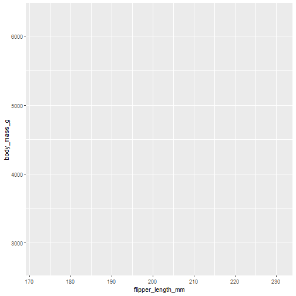

```r
#What this adds is labels that are the colnames of the variables we are interested in, and relevant axes scales, and some gridlines

#Next we add the relevant geometrical object that a plot uses to represent data i.e. a geom
#In this case because both x and y variables are numeric (well - body_mass_g is an integer) we can use a scatterplot which is geom_point
ggplot(data = penguins, mapping = aes(x = flipper_length_mm, y = body_mass_g)) +
  geom_point()
```

```
## Warning: Removed 2 rows containing missing values (`geom_point()`).
```

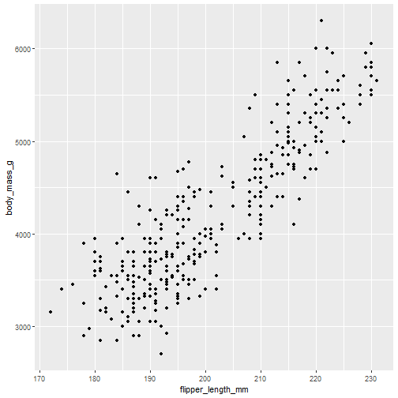

```r
#If we want colors we need to use the American spelling of colour i.e. color and add it within the mapping brackets
ggplot(data = penguins, mapping = aes(x = flipper_length_mm, y = body_mass_g, color = species)) +
  geom_point()
```

```
## Warning: Removed 2 rows containing missing values (`geom_point()`).
```

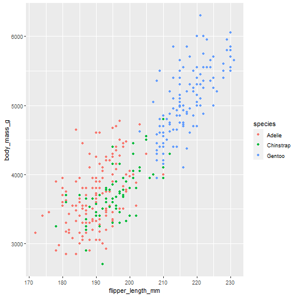

```r
#If you just wanted to change the points from black to e.g. blue you could just do this
ggplot(data = penguins, mapping = aes(x = flipper_length_mm, y = body_mass_g)) +
  geom_point(color = "blue")
```

```
## Warning: Removed 2 rows containing missing values (`geom_point()`).
```

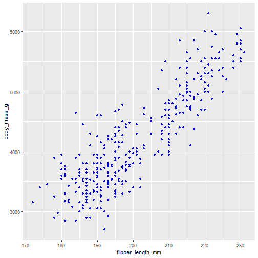

```r
#Note if you try and specify a colour inside the aes section it thinks you're just labelling the points with the label "blue" 
#it will still choose your colour scheme
ggplot(data = penguins, mapping = aes(x = flipper_length_mm, y = body_mass_g, color = "blue")) +
  geom_point()
```

```
## Warning: Removed 2 rows containing missing values (`geom_point()`).
```

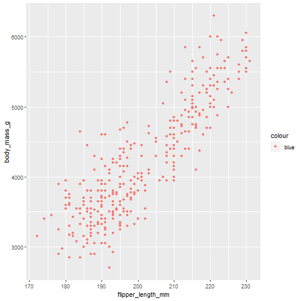

```r
#If on the other hand you have corporatebranding and need to be very specific about colours you can specify these explicitly
levels(data$species)
```

```
## [1] "Adelie"    "Chinstrap" "Gentoo"
```

```r
ggplot(data = penguins, mapping = aes(x = flipper_length_mm, y = body_mass_g, color = species)) +
  geom_point() + 
  scale_color_manual(values = c("Adelie" = "purple",
                                "Chinstrap" ="orange",
                                "Gentoo"="steelblue"))
```

```
## Warning: Removed 2 rows containing missing values (`geom_point()`).
```

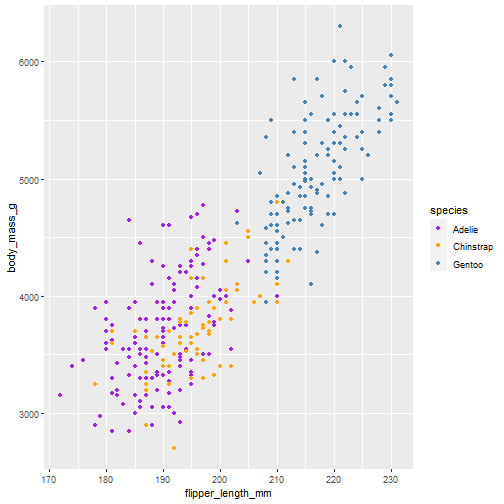

```r
#You actually don't need to specify the names of your levels as long as you know how many colours you need
#You can use hex codes for the perfect organisational pantone etc rather than named colors in the vector I've used here

nlevels(penguins$species) #we need 3 colors in the vector
```

```
## [1] 3
```

```r
ggplot(data = penguins, mapping = aes(x = flipper_length_mm, y = body_mass_g, color = species)) +
  geom_point() + 
  scale_color_manual(values = c("red", "gold", "green"))
```

```
## Warning: Removed 2 rows containing missing values (`geom_point()`).
```

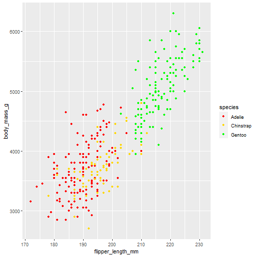

```r
#Adding model fit is next
ggplot(data = penguins, mapping = aes(x = flipper_length_mm, y = body_mass_g, color = species)) +
  geom_point() +
  geom_smooth(method = "lm")
```

```
## `geom_smooth()` using formula = 'y ~ x'
```

```
## Warning: Removed 2 rows containing non-finite values (`stat_smooth()`).
## Removed 2 rows containing missing values (`geom_point()`).
```

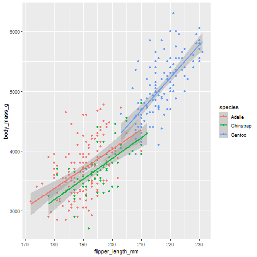

```r
#Note we get one lm trendline per species - this is because of where we have species in the code, in the mapping. 
#If we move the info on species color to geom_point it will apply the linear model trendline to the whole dataset
ggplot(data = penguins, mapping = aes(x = flipper_length_mm, y = body_mass_g)) +
  geom_point(mapping = aes(color = species)) +
  geom_smooth(method = "lm")
```

```
## `geom_smooth()` using formula = 'y ~ x'
```

```
## Warning: Removed 2 rows containing non-finite values (`stat_smooth()`).
## Removed 2 rows containing missing values (`geom_point()`).
```


```r
#We add shape to the point aesthetics in case people are colour blind (or if you're submitting this to a journal that prints in b&w)
#Can be a waste of info if there's another variable you were interested in that could be defined by shape
ggplot(data = penguins, mapping = aes(x = flipper_length_mm, y = body_mass_g)) +
  geom_point(mapping = aes(color = species, shape = species)) +
  geom_smooth(method = "lm")
```

```
## `geom_smooth()` using formula = 'y ~ x'
```

```
## Warning: Removed 2 rows containing non-finite values (`stat_smooth()`).
## Removed 2 rows containing missing values (`geom_point()`).
```

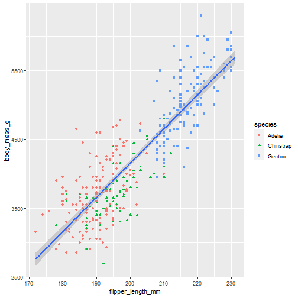

```r
#See later on in chapter for an example of this:
ggplot(penguins, aes(x = flipper_length_mm, y = body_mass_g)) +
  geom_point(aes(color = species, shape = island))
```

```
## Warning: Removed 2 rows containing missing values (`geom_point()`).
```

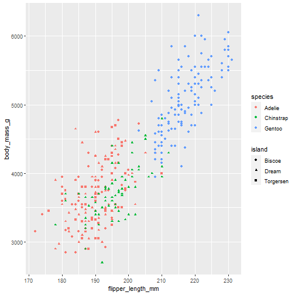

```r
#You can explicitly specify that you want a color palette that is appropriate for colour blind people
ggplot(data = penguins, mapping = aes(x = flipper_length_mm, y = body_mass_g)) +
  geom_point(mapping = aes(color = species, shape = species)) +
  geom_smooth(method = "lm") +
  scale_color_colorblind()
```

```
## `geom_smooth()` using formula = 'y ~ x'
```

```
## Warning: Removed 2 rows containing non-finite values (`stat_smooth()`).
## Removed 2 rows containing missing values (`geom_point()`).
```

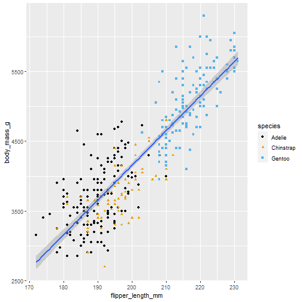

```r
#We can add labels to the axes as sometimes these can be named rather obscurely and readers 
ggplot(data = penguins, mapping = aes(x = flipper_length_mm, y = body_mass_g)) +
  geom_point(mapping = aes(color = species, shape = species)) +
  geom_smooth(method = "lm") +
  labs(
    title = "Body mass and flipper length",
    subtitle = "Dimensions for Adelie, Chinstrap, and Gentoo Penguins",
    x = "Flipper length (mm)", y = "Body mass (g)",
    color = "Species", shape = "Species") + 
  scale_color_colorblind()
```

```
## `geom_smooth()` using formula = 'y ~ x'
```

```
## Warning: Removed 2 rows containing non-finite values (`stat_smooth()`).
## Removed 2 rows containing missing values (`geom_point()`).
```

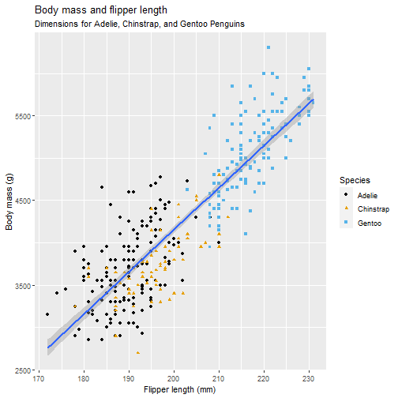

```r
#How does our masterpiece compare to base R?
plot(penguins$flipper_length_mm, penguins$body_mass_g)
```

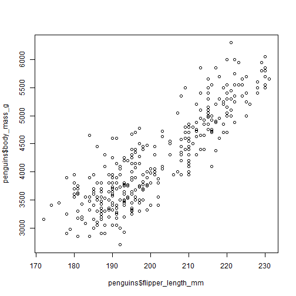

```r
#Can add labels
plot(penguins$flipper_length_mm, penguins$body_mass_g, xlab = c("Flipper length"), ylab = c("Body Mass"))
```

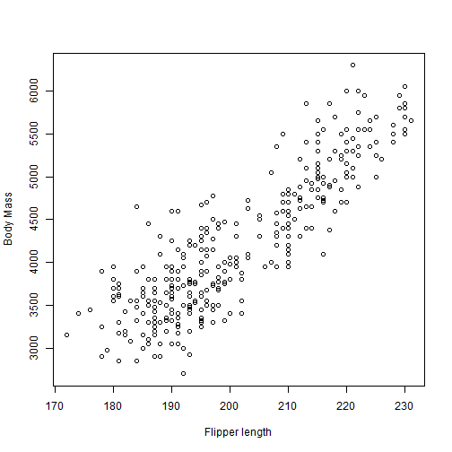

```r
#Can change shapes
plot(penguins$flipper_length_mm, penguins$body_mass_g, xlab = c("Flipper length"), ylab = c("Body Mass"), pch=2)
```

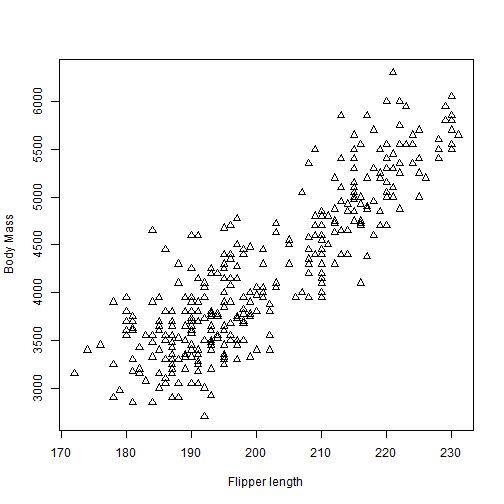

```r
#Can add color
plot(penguins$flipper_length_mm, penguins$body_mass_g, xlab = c("Flipper length"), ylab = c("Body Mass"), pch=2, col = "blue")
```

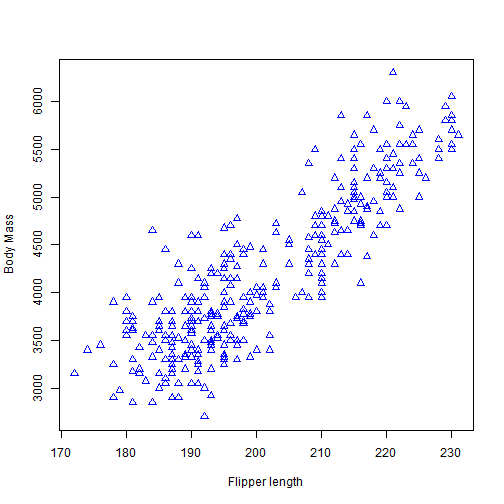

```r
#Can put colours in by factor level
plot(penguins$flipper_length_mm, penguins$body_mass_g, xlab = c("Flipper length"), ylab = c("Body Mass"), pch=2, 
     col = as.numeric(penguins$species)+1)
```

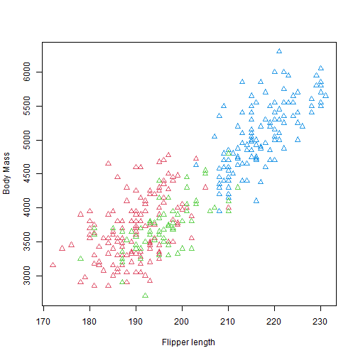

```r
#Make shape a function of of species too
plot(penguins$flipper_length_mm, penguins$body_mass_g, xlab = c("Flipper length"), ylab = c("Body Mass"), 
     pch= as.numeric(penguins$species)+1, 
     col = as.numeric(penguins$species)+1)
```

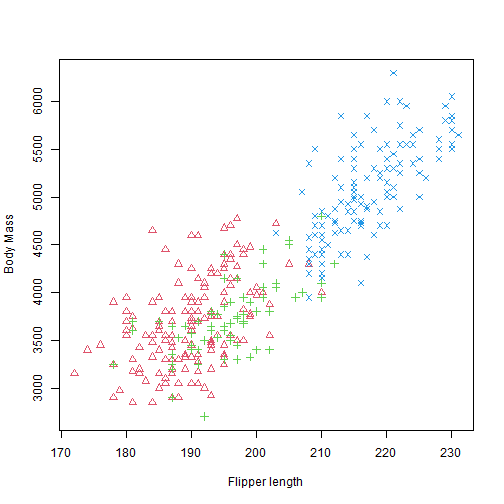

```r
#Add a legend
plot(penguins$flipper_length_mm, penguins$body_mass_g, xlab = c("Flipper length"), ylab = c("Body Mass"), 
     pch= as.numeric(penguins$species), 
     col = as.numeric(penguins$species))
legend(170, 6400, legend=c(levels(penguins$species)), col = 1:length(penguins$species), fill = c(1:length(penguins$species))) 
```

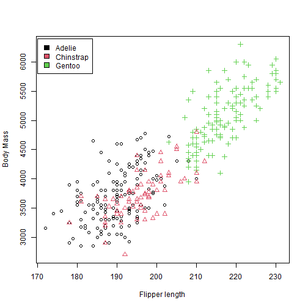

```r
#Add a trendline
plot(penguins$flipper_length_mm, penguins$body_mass_g, xlab = c("Flipper length"), ylab = c("Body Mass"), 
     pch= as.numeric(penguins$species), 
     col = as.numeric(penguins$species))
legend(170, 6400, legend=c(levels(penguins$species)), col = 1:length(penguins$species), fill = c(1:length(penguins$species))) 
abline(lm(penguins$body_mass_g ~ penguins$flipper_length_mm), col = "purple")
```


```r
#Moving on - geom_bar
#Bar plots are also useful - the sort of things often reported on go in bargraphs

ggplot(penguins, aes(x = species)) +
  geom_bar()
```

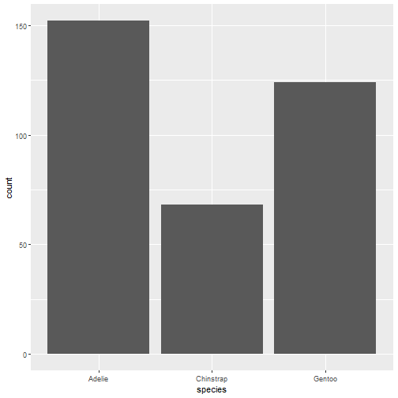

```r
levels(penguins$species)
```

```
## [1] "Adelie"    "Chinstrap" "Gentoo"
```

```r
#Useful function is to be able to relevel a factor by frequency
ggplot(penguins, aes(x = fct_infreq(species))) +
  geom_bar()
```

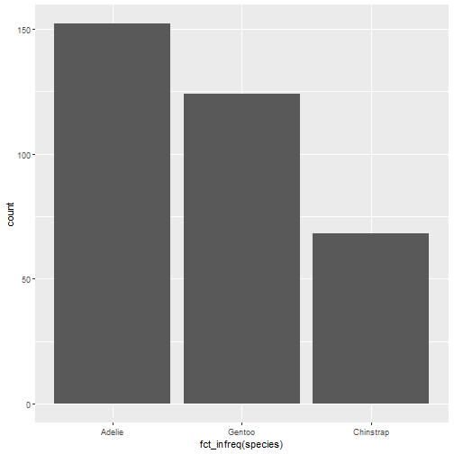

```r
#barplots can be useful if you have multiple factor variables too
ggplot(penguins, aes(x = island, fill = species)) +
  geom_bar()
```

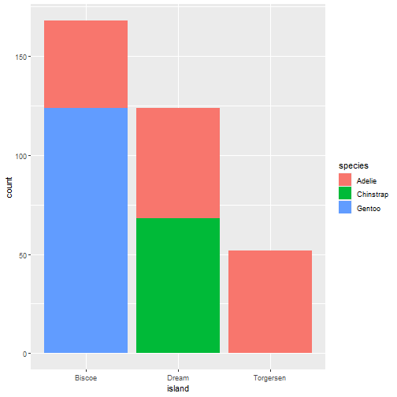

```r
#later on in chapter 10 you see how complicated you can go with geom_bar (e.g. if you use fill by a factor variable with lots of levels)
#Starts to look a mess
#color = factor level (seems to put a colour around the bars but not fill them) 
#see version 1 of R for data science has a visual on this using diamonds dataset
#Can use fill = NA for an outline only bar graph
#Using dodge rather than fill if you want each category to have 1 bar per level of the x-axis variable
#Using fill = same factor), position = "fill" leads to prop stacked bars?
#Seems to be more detail on this (or visuals are just bigger) in the older version

#Histograms in ggplot are more of a faff
ggplot(penguins, aes(x = body_mass_g)) +
  geom_histogram(binwidth = 200)
```

```
## Warning: Removed 2 rows containing non-finite values (`stat_bin()`).
```

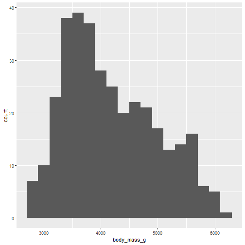

```r
#Avoid bothering to set your own binwidth by using base R
hist(penguins$body_mass_g, freq = T)
```


```r
#Can turn it into a density plot by using freq=F
hist(penguins$body_mass_g, freq = F)
```

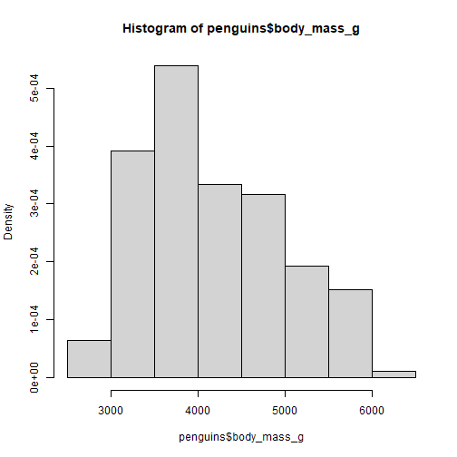

```r
#geom_density in ggplot much more fun
ggplot(penguins, aes(x = body_mass_g)) +
  geom_density()
```

```
## Warning: Removed 2 rows containing non-finite values (`stat_density()`).
```

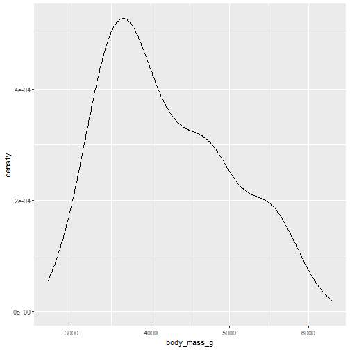

```r
#Looking comparing densities can be useful for anova assumptions etc
ggplot(penguins, aes(x = body_mass_g, color = species)) +
  geom_density(linewidth = 0.75)
```

```
## Warning: Removed 2 rows containing non-finite values (`stat_density()`).
```

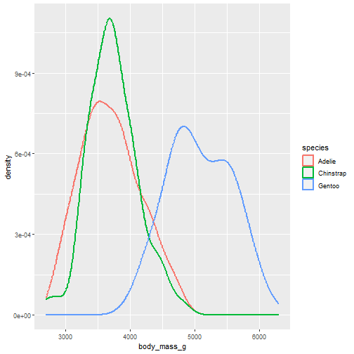

```r
#Want to explore geom_freqpoly which is covered in chapter 11 but seems to be doing something similar but with count?
ggplot(penguins, aes(x = body_mass_g)) + 
  geom_freqpoly(aes(color = species), binwidth = 500, linewidth = 0.75)
```

```
## Warning: Removed 2 rows containing non-finite values (`stat_bin()`).
```

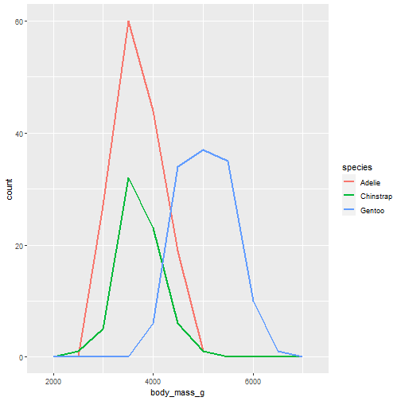

```r
#Can install ggridges and make a Joy Division debut album cover! This is described in chapter 10 and wasn't previously in the book in the old version
#install.packages("ggridges")
library(ggridges)

#The next section of visualisations is about boxplots (also covered in further detail in Chapter 11)
#A lot of natural NHS data looks appaling in boxplots (Length of stay data?!) but they are a good simplistic one
ggplot(penguins, aes(x = species, y = body_mass_g)) +
  geom_boxplot()
```

```
## Warning: Removed 2 rows containing non-finite values (`stat_boxplot()`).
```

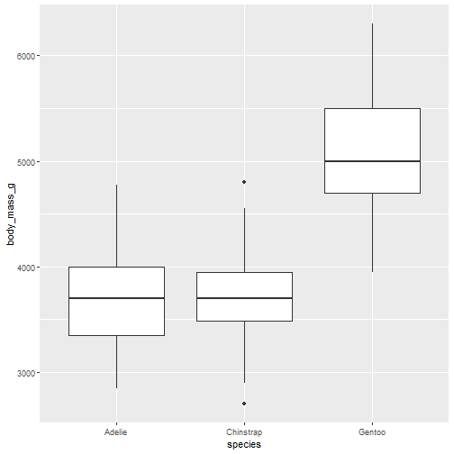

```r
#Geom density better for skewed data
ggplot(penguins, aes(x = body_mass_g, color = species, fill = species)) +
  geom_density(alpha = 0.5)
```

```
## Warning: Removed 2 rows containing non-finite values (`stat_density()`).
```

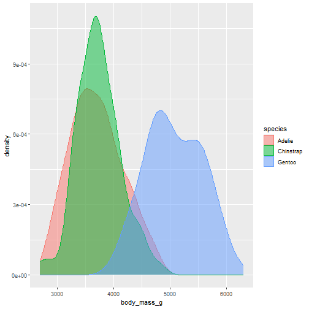

```r
#Can look at facet wraps
ggplot(penguins, aes(x = flipper_length_mm, y = body_mass_g)) +
  geom_point(aes(color = species, shape = species)) +
  facet_wrap(~island)
```

```
## Warning: Removed 2 rows containing missing values (`geom_point()`).
```

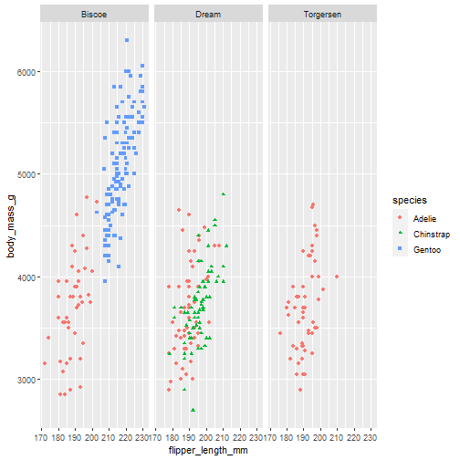

```r
#Facet wraps probably useful for chapter 11 when you're exploring your own data (e.g. wanting a correlation matrix) 
#but if you put them in a report, someone might quibble - depends on audience and people's preferences

#Combined plot is an earlier example we looked at where shape is used for island instead
#So there are choices for how we convey info - do you have support where you work for this or do you have to choose?
ggplot(penguins, aes(x = flipper_length_mm, y = body_mass_g)) +
  geom_point(aes(color = species, shape = island))
```

```
## Warning: Removed 2 rows containing missing values (`geom_point()`).
```


```r
# Daft example with penguin unicode
ggplot(data = penguins, mapping = aes(x = flipper_length_mm, y = body_mass_g)) +
  geom_text(aes(color = species, label = "🐧")) +
  geom_smooth(method = "lm") +
  labs(
    title = "Body mass and flipper length",
    subtitle = "Dimensions for Adelie, Chinstrap, and Gentoo Penguins",
    x = "Flipper length (mm)", y = "Body mass (g)",
    color = "Species", shape = "Species") + 
  scale_color_colorblind()
```

```
## `geom_smooth()` using formula = 'y ~ x'
```

```
## Warning: Removed 2 rows containing non-finite values (`stat_smooth()`).
```

```
## Warning: Removed 2 rows containing missing values (`geom_text()`).
```

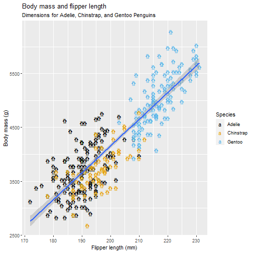

